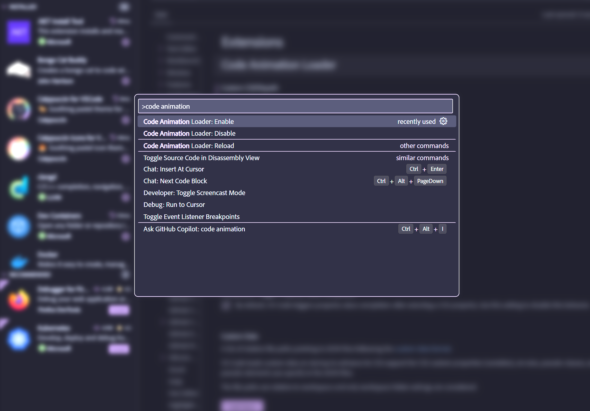

# Code Animation Loader - a tiny custom js/css loader for VS Code

## Story

I have been enjoying the great extension [Apc Customize UI++](https://marketplace.visualstudio.com/items?itemName=drcika.apc-extension) for several months. It is a great extension that allows you to customize the UI of VS Code. However, it went [broken](https://github.com/drcika/apc-extension/issues/230#issuecomment-2392181820) after vscode version 1.93.0 and the author was too busy to fix it. There had already been some forks with limited features such as [Custom UI](https://github.com/subframe7536/vscode-custom-ui-style) but on my PC it does not work well. So I decided to write a tiny custom js/css loader for VS Code. It's a really simple extension, only adding a command to load custom js/css files. It works well on my PC, and I hope it will help you too.

## Features

in `settings.json`, add the following lines:

```json
    "code-animation-loader.customCSSFilepath": "path/to/your/custom.css",
    "code-animation-loader.customJSFilepath": "path/to/your/custom.js",
```

then press `F1` and type `Code Animation Loader: Enable` to enable the custom js/css files, `Disable` to disable them, and `Reload` to reload them.

## Example

example with [central-launchpad.css](./examples/central-launchpad.css):


**Enjoy!**
